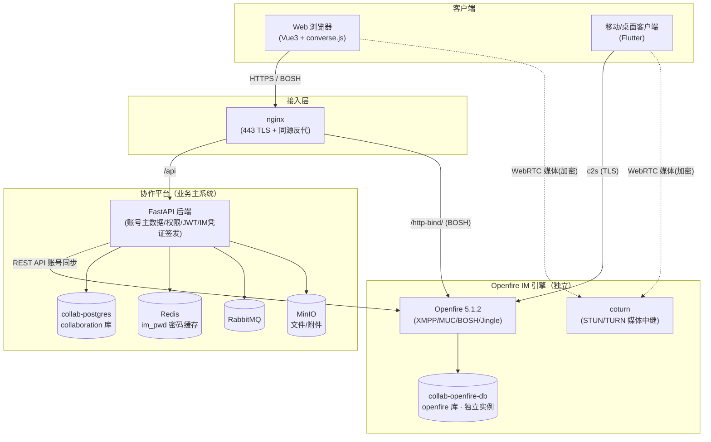
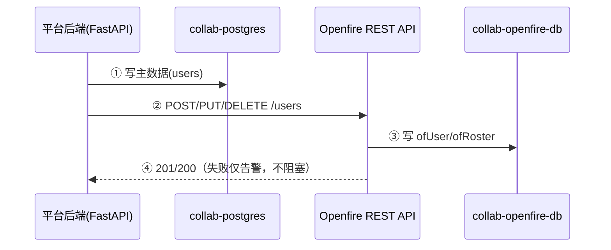
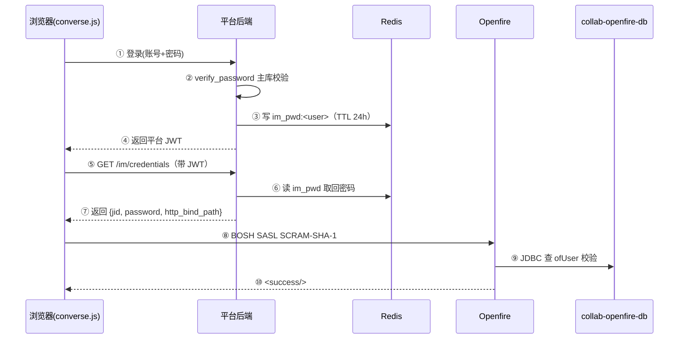
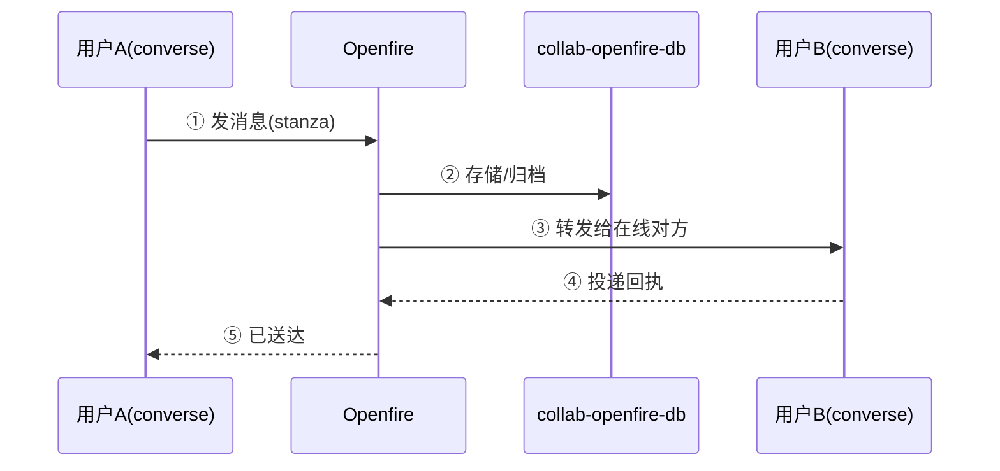
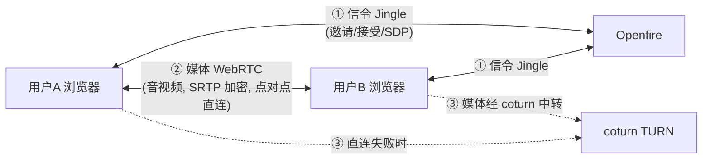

# 02 概要设计（HLD）— Openfire IM 服务端

> 版本：v1.1 · 2026-09-22 · 读者：Openfire 开发人员
> 前置：先读 01 需求规格说明书。

---

## 1. 总体架构

### 1.1 分层定位

Openfire 在平台五层架构中位于**能力引擎层（Capability Engines）**，与 OnlyOffice、MinIO 并列——是「纯 XMPP/IM 引擎」，不维护企业主数据、不维护核心 ACL。

```
访问层        Web(Vue3) / Flutter 客户端
统一身份      API Gateway(JWT) ← Keycloak(企业身份, M6 可选)
业务平台层    消息 / 日历 / 通讯录 / 工作组 / 系统管理 / 通知中心
能力引擎层    ★ Openfire(XMPP/IM)  OnlyOffice  MinIO
基础设施      PostgreSQL(平台库)  PostgreSQL(Openfire 独立实例)  Redis  RabbitMQ  MinIO  coturn
```

### 1.2 组件架构图



### 1.3 职责边界

| 组件 | 职责 | 不负责 |
|---|---|---|
| 协作平台后端 | 账号主数据、权限 ACL、JWT 签发、IM 凭证签发、账号同步 | 不碰 Openfire DB |
| Openfire | 消息收发、MUC、presence、roster、Jingle 信令 | 不维护企业权限、不承载媒体流 |
| coturn | STUN/TURN 媒体中继 | 不处理信令 |
| Redis | 缓存 IM 明文密码（im_pwd，TTL 24h） | — |

### 1.4 关键概念：协议 / 实现 / 组件（避免混淆）

**XMPP / MUC / BOSH / Jingle 是「协议与规范」，不是「组件」。** 它们是 Openfire 这一个软件内置实现的能力，**不能拆分为独立服务**。

| 术语 | 性质 | 说明 |
|---|---|---|
| XMPP | 核心协议 | 即时通讯的行业标准（类比 HTTP 之于 Web） |
| MUC（XEP-0045） | 协议扩展 | 定义「群聊」的规范 |
| BOSH（XEP-0124/0206） | 传输方式 | 定义「浏览器经 HTTP 长轮询连 XMPP」的规范 |
| Jingle（XEP-0166/0167/0176） | 协议扩展 | 定义「音视频通话信令」的规范 |

**Openfire = 实现这些协议的服务器软件**：一个 Openfire 进程内置 MUC、BOSH、Jingle，随 Openfire 同启同停、共享同一配置与数据库，因此架构图上它们是 Openfire 内部的模块，而非独立容器。

**唯一的拆分点：信令与媒体分离。**

- **信令**（邀请 / 接听 / 挂断 / SDP 协商）→ 走 Openfire（Jingle）
- **媒体**（音视频数据流）→ **不经过 Openfire**，走浏览器点对点直连；直连失败时经 **coturn**（独立容器 `collab-coturn`）中转

> 一句话：XMPP 是协议、Openfire 是实现；MUC/BOSH/Jingle 是 Openfire 内置能力，不可拆分；唯一拆出 Openfire 的是「媒体数据」（交给 coturn），因为媒体流不该占用 Openfire 的信令通道。

### 1.5 解耦边界与耦合清单

**解耦目标**：Openfire 作为协作平台「可插拔的独立 IM 服务」——协作平台的核心业务（账号、组织、登录、权限）不依赖 Openfire 的内部实现；Openfire 故障、重启、甚至整体替换，协作平台核心业务不受影响。两者只通过**标准接口**（REST API + XMPP/BOSH）交互，不共享数据库、不共享认证。

**耦合类型说明**（软件工程标准术语，用于下表的分类）：

| 耦合类型 | 含义 | 松/紧 |
|---|---|---|
| 接口耦合 | 只通过标准 API/协议调用，不关心对方内部实现 | 松（好） |
| 数据耦合 | 两边共享/复制同一份数据 | 紧（需谨慎） |
| 基础设施耦合 | 共用同一组件/网络/部署单元 | 紧（需隔离） |
| 配置耦合 | 两边配置项需保持一致 | 中 |

**解耦边界清单（核心）**：

| # | 耦合维度 | 耦合类型 | 当前实现 | 解耦状态 | 影响与说明 |
|---|---|---|---|---|---|
| 1 | 数据库 | 基础设施耦合 | Openfire 独立 postgres 实例（`collab-openfire-db`，端口 25432），与平台主库物理隔离 | ✅ 已解耦 | 任一库维护/崩溃不影响另一方 |
| 2 | 账号数据 | 数据耦合 | 平台为账号主数据；Openfire 存影子账号副本；同步走 REST API，后端零直连 Openfire DB | ✅ 已解耦 | 已删 `_sync_via_db`/`openfire_database_url`，代码无直连残留 |
| 3 | 认证 | 控制耦合 | 平台认证走本地库（`users.password_hash`）；IM 认证走 Openfire JDBC（`ofUser`） | ✅ 已解耦 | 两条独立认证链，互不依赖 |
| 4 | 账号同步接口 | 接口耦合 | REST API 插件（`/plugins/restapi/v1/users` 等 7 端点），basic auth | ✅ 已解耦 | 标准接口，Openfire 可被替换为其他 XMPP 服务器（需同协议） |
| 5 | 消息/通话 | 接口耦合 | XMPP 协议（BOSH/MUC/Jingle），前端直连 Openfire | ✅ 已解耦 | 标准协议，前端不依赖 Openfire 专有 API |
| 6 | 聊天记录 | 数据耦合 | 历史消息归档（MAM/XEP-0313）只存 Openfire 侧（`ofMessageArchive`） | ⚠️ 软连接 | 平台读历史走 MAM 协议，不落平台库；替换 Openfire 需迁移归档数据 |
| 7 | 影子账号密码 | 数据耦合 | 平台建号时把明文密码同步到 `ofUser`（两边各存一份） | ⚠️ 软连接 | 影子账号机制代价；改密需同步两边 |
| 8 | coturn（音视频中继） | 配置耦合 | 媒体中继服务，前端与 Openfire 部署均引用同一套端口/账号/密码 | ⚠️ 软连接 | coturn 归协作平台负责人统一配；Openfire 侧照着配保持一致 |

**结论**：

- **解耦程度：已达成「可插拔独立服务」目标**。协作平台通过「REST API（管理）+ XMPP（业务）」两条标准通道调用 Openfire，不碰其数据库、不共享认证；Openfire 故障/替换不影响平台账号、登录、组织、权限等核心业务。
- **残余 3 个软连接（#6/#7/#8）均属 IM 功能天然归属**：聊天记录、影子账号密码、音视频中继本就该落在 IM 引擎/媒体组件上，是「合理边界」而非「坏耦合」。
- **可替换性结论**：理论上可把 Openfire 替换为任一「标准 XMPP 服务器 + REST 管理接口」的实现；唯一需迁移的是「聊天记录归档」（#6）与「影子账号」（#7），迁移成本集中在这两处。

---

## 2. 模块划分

| 模块 | 位置 | 职责 |
|---|---|---|
| 账号同步模块 | `backend/app/services/im_service.py` | 建号/改密/禁用/删除 → REST API 同步影子账号 + roster |
| 凭证签发模块 | 同上 `credentials_for`/`cache_im_password` | 登录时写 Redis 缓存，前端取回 jid+密码 |
| REST API 插件 | Openfire 内 `restapi-1.12.0` | 提供 `/plugins/restapi/v1/*` 账号 CRUD 端点 |
| monitoring 插件（消息归档） | Openfire 内（**monitoring-2.8.0 已装**） | 消息归档（MAM/XEP-0313），历史记录跨设备同步 |
| 前端 converse.js | `web/` MessagesView | BOSH 连接、聊天 UI、Jingle 通话 |
| coturn | 独立容器 | 媒体中转 |

**账号同步模块核心方法**（`im_service.py`）：
- `sync_user_to_openfire(user, password)` — 幂等创建/更新影子账号（GET→PUT/POST）
- `sync_roster_for_user(db, user)` — 全员双向 roster（sub=3）
- `deactivate_user_in_openfire(user, keep_cache)` — 停用/离职删影子账号
- `reactivate_user_in_openfire(user)` — 恢复在职重建影子账号
- `delete_user_from_openfire(user)` — 删影子账号（幂等 200/404）

---

## 3. 关键数据流

### 3.1 账号同步（平台 → Openfire）



### 3.2 IM 登录认证



> 设计取舍：Openfire JDBC 认证需要可逆密码比对，故 `ofUser` 存 `encryptedPassword`（Blowfish 可逆）、Redis 缓存明文密码。密码**不落前端**（不写 localStorage/sessionStorage），由 JWT 从服务端换取。

### 3.3 消息收发



### 3.4 音视频（信令与媒体分离）



> 关键：信令（控制消息）走 Openfire，媒体（音视频数据）走浏览器点对点 + coturn 中转，Openfire **不承载媒体流**。

---

## 4. 技术选型

| 环节 | 选型 | 理由 |
|---|---|---|
| IM 引擎 | Openfire 5.1.2（社区版） | 标准 XMPP，无 SDK 锁定，野火替换定案；5.1.2 修复 BOSH 僵尸会话 bug |
| 账号同步 | REST API 插件 1.12.0 | 路线 B，满足「禁止直连 DB」约束 |
| 消息归档 | monitoring 插件 2.8.0（已装） | MAM/XEP-0313，历史记录跨设备同步 |
| Web 客户端 | converse.js 14.x（BOSH） | 开箱即用，SCRAM 自动协商 |
| 移动客户端 | Smack / Flutter xmpp 社区包 | 无官方 SDK，用通用 XMPP 库 |
| 媒体 | WebRTC + coturn | 1v1 音视频，SRTP 加密 |
| 数据库 | Openfire 独立 postgres 实例 | 故障隔离 |

---

## 5. 能力映射（野火 → Openfire）

| PRD 要求的能力 | Openfire 实现 | 状态 |
|---|---|---|
| 单聊（文本/图片/文件/表情） | XMPP message + XEP-0363 附件 | ✅ 已实现 |
| 消息归档（历史记录同步） | monitoring 插件 MAM/XEP-0313 | ✅ 已实现 |
| 群聊（建群/拉人/退群/@提醒） | MUC `conference.xmpp.collab.local` | ✅ 已实现 |
| 1v1 音视频通话 | Jingle + WebRTC + coturn | ✅ 已实现 |
| 系统消息（通知公告） | bot 账号广播 | ⚠️ 待补（通知中心→Openfire 通道） |
| 消息已读回执 | XEP-0184 + XEP-0333 | ⚠️ converse 部分支持，待验证 |
| 多方音视频会议 | Openfire 无内置 SFU | ❌ 缺失（需另选组件） |
| 会议录制 | 无内置 | ❌ 缺失 |
| 移动离线推送 | 社区版无内置 | ❌ 缺失（需 Push 插件 + 自研） |
| 官方 Flutter/PC SDK | 无官方 SDK | ⚠️ 用通用 XMPP 库 |

**结论**：Openfire 完整覆盖 IM 核心（单聊/群聊/1v1 音视频），**多方会议、录制、离线推送、官方 SDK 四项缺失**，需在里程碑排期单独评估，不能默认无缝承接野火商业版能力。

---

## 6. 高可用设计

| 优先级 | 目标 | 方案 |
|---|---|---|
| P0 | 数据层 HA | 两个 postgres 各自主从（平台库 / Openfire 库独立） |
| P1 | IM 横向扩展 | Openfire 多节点 + BOSH sticky（LB 会话粘滞）；接受「断线重连恢复」 |
| P2 | 依赖降级 + 可观测 | Redis 哨兵、RabbitMQ 镜像队列；Prometheus JMX exporter |

> Openfire 社区版 MUC/BOSH 会话复制不完整，故采用「无状态多节点 + sticky + 重连恢复」而非强一致集群——这是与野火商业版集群的明确差距。
