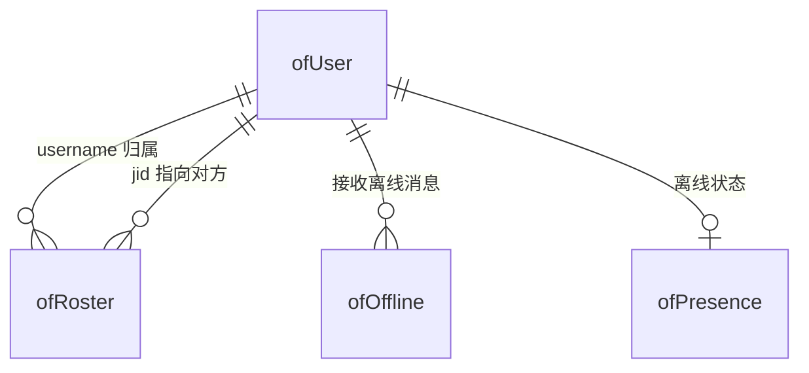

# 03 接口设计（API 规格）— Openfire 对接

> 版本：v1.0 · 2026-09-20 · 读者：Openfire 开发人员
> 前置：先读 01 需求、02 概要设计。本文定义账号同步接口的**精确契约**与**数据模型**。

---

## 1. 接口总览

> 完整前缀：`http://<Openfire地址>:9090/plugins/restapi/v1`（容器内）；宿主机调试 `http://127.0.0.1:19090/plugins/restapi/v1`

| # | 方法 + 路径 | 用途 | 平台触发时机 |
|---|---|---|---|
| 1 | `POST /users` | 创建 IM 账号 | 建新用户 / 恢复在职 |
| 2 | `GET /users/{username}` | 查询账号是否存在 | 校验 / 对账 |
| 3 | `PUT /users/{username}` | 改密码 / 改资料 | 改密、重置密码、改姓名邮箱 |
| 4 | `DELETE /users/{username}` | 删除账号 | 停用 / 离职 |
| 5 | `POST /users/{username}/roster` | 加联系人 | 建双向通讯录 |
| 6 | `GET /users/{username}/roster` | 查联系人 | 对账 / 排障 |
| 7 | `GET /sessions` | 查在线会话 | 排障 / 监控（可选） |

## 2. 认证方式

| 方式 | 怎么传 | 适用 |
|---|---|---|
| HTTP Basic Auth（当前用） | `curl -u "admin:<密码>"` | 简单，管理台账号 |
| Secret Key（备选） | 请求头 `Authorization: <secretKey>`，插件配置 `plugin.restapi.secretKey` | 避免暴露 admin 口令 |

> REST API 插件需 3 个 ofProperty（缺一会 302/401）：`plugin.restapi.enabled=true`、`adminConsole.access.allow-wildcards-in-excludes=true`、`plugin.restapi.httpAuth=basic`。

---

## 3. 接口详细定义

### 3.1 创建用户 `POST /users`

请求体：
```json
{
  "username": "zhangsan",          // 必填，唯一，全小写无空格
  "name": "张三",                   // 可选，显示名
  "email": "zs@example.com",        // 可选
  "password": "<明文密码>"          // 必填，Openfire 落 encryptedPassword
}
```
- 成功：`201 Created`
- 失败：`409`（已存在）/ `400`（缺字段）/ `401`（认证失败）

```bash
curl -u "admin:<ADMIN_PWD>" -H "Content-Type: application/json" \
  -X POST http://127.0.0.1:19090/plugins/restapi/v1/users \
  -d '{"username":"zhangsan","name":"张三","email":"zs@example.com","password":"<测试密码>"}'
```

> ⚠️ `username` 必须全小写、无空格：Openfire `DefaultAuthProvider.authenticate` 会 `trim().toLowerCase()` 后精确查 `ofUser.username`，大写/空格导致「密码对却登录失败」。

### 3.2 查询用户 `GET /users/{username}`
成功 `200`（返回 JSON）；失败 `404`/`401`。

### 3.3 修改用户 `PUT /users/{username}`
只传要改的字段：
```json
{ "password": "<新密码>" }                        // 改密
{ "name": "张三丰", "email": "zsf@example.com" }  // 改资料
```
成功 `200`；失败 `404`/`401`。

### 3.4 删除用户 `DELETE /users/{username}`
成功 `200`；失败 `404`/`401`。幂等：404（已删）按成功处理。

### 3.5 加联系人 `POST /users/{username}/roster`
```json
{
  "jid": "lisi@xmpp.collab.local",
  "nickname": "李四",
  "subscriptionType": "3"
}
```
`subscriptionType`：`-1` 移除 / `0` 无 / `1` 对方订阅我 / `2` 我订阅对方 / `3` 双向。全员通讯录用 `3`，双向需对 A 加 B + 对 B 加 A 各调一次。成功 `201`；失败 `404`/`401`。

### 3.6 查询联系人 `GET /users/{username}/roster`
`200` + roster 列表 JSON。

### 3.7 在线会话 `GET /sessions`
`200` + 在线会话列表 JSON（排障/监控）。

---

## 4. 数据模型

> 关键结论：Openfire 全部数据在独立库 `openfire`（33 张表）。对接开发只需关注以下 5 张核心表，其余为 MUC/群组/配置/审计。

### 4.1 核心表结构（实测 5.1.2）

**ofUser — 用户账号**（账号同步的目标表）

| 字段 | 类型 | 说明 |
|---|---|---|
| username | varchar(64) PK | 用户名（**小写无空格**） |
| encryptedpassword | varchar(255) | Blowfish 可逆密文（REST API 落此字段） |
| plainpassword | varchar(32) | 明文（历史遗留，路线 B 不再写） |
| storedkey/serverkey/salt/iterations | varchar(32)/int | SCRAM 凭据（备用） |
| name / email | varchar(100) | 显示名 / 邮箱 |
| creationdate / modificationdate | char(15) | 创建/修改时间 |

**ofRoster — 通讯录（好友关系）**

| 字段 | 类型 | 说明 |
|---|---|---|
| rosterid | int PK | 自增 |
| username | varchar(64) | 归属用户 |
| jid | varchar(1024) | 对方 JID |
| sub | int | 订阅类型（3=双向） |
| ask / recv | int | 订阅请求状态 |
| nick | varchar(255) | 显示昵称 |

**ofPresence — 离线状态（注意：在线状态在内存，不在此表）**

| 字段 | 类型 | 说明 |
|---|---|---|
| username | varchar(64) PK | 用户 |
| offlinepresence | text | 用户离线时的最后 presence |
| offlinedate | varchar(15) | 离线时间 |

> ⚠️ **易错点**：`ofPresence` 存的是**离线** presence（供离线显示），**在线用户数不查这张表**。在线会话用 `GET /sessions`（REST API）或管理台「会话」页。

**ofOffline — 离线消息（对方不在线时暂存）**

| 字段 | 类型 | 说明 |
|---|---|---|
| username + messageid | 联合 PK | 接收者 + 消息 ID |
| creationdate | char(15) | 时间 |
| messagesize | int | 大小 |
| stanza | text | 消息内容（XML） |

### 4.2 表关系（ER 简图）



---

## 5. 账号同步触发规则（后端实现）

| 平台事件 | 调用接口 | 后端方法 |
|---|---|---|
| 创建用户 | `POST /users` | `sync_user_to_openfire(user, password)` |
| 修改/重置密码 | `PUT /users/{username}` | 同上 + `cache_im_password` |
| 修改姓名/邮箱 | `PUT /users/{username}` | 同上 |
| 停用（status=0） | `DELETE /users/{username}` | `deactivate_user_in_openfire(keep_cache=True)` |
| 离职（status=2） | `DELETE /users/{username}` | `deactivate_user_in_openfire(keep_cache=False)` |
| 恢复在职（status=1） | `POST /users` | `reactivate_user_in_openfire` |
| 建通讯录 | `POST /users/{a}/roster` + `/users/{b}/roster` | `sync_roster_for_user` |

---

## 6. 错误处理约定

| HTTP 码 | 含义 | 平台处理 |
|---|---|---|
| 200 / 201 | 成功 | 继续 |
| 401 | 认证失败 | 检查 admin 密码/secretKey，告警 |
| 404 | 目标不存在 | 按幂等处理（删除已删的→忽略） |
| 409 | 冲突（重复建号） | 改为 `PUT` 更新 |
| 400 | 参数错 | 检查字段格式，告警 |

**通用原则**：同步失败**不阻塞平台主流程**，仅记录告警日志；对账/补同步可后续修复。
