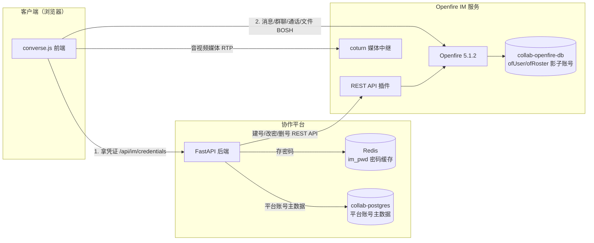

# 03b 服务集成设计 — Openfire 作为协作平台服务的调用通道

> 版本：v1.1 · 2026-09-22 · 读者：协作平台负责人（对接方）+ Openfire IM 测试/部署负责人
> 前置：先读 01 需求、02 概要设计、03 接口设计。
> 与 03 的关系：**03 讲「账号同步 REST API 的精确契约」（每个接口请求/响应/错误码）；本文讲「Openfire 所有能力如何被协作平台调用」的全景**——哪些走 REST API、哪些走 XMPP 直连、怎么连、怎么认证。

---

## 1. 定位与核心结论

Openfire 作为协作平台的一个服务，对外提供能力的方式**不是单一 API，而是两条完全不同的通道**：

| 通道 | 性质 | 谁调用 | 干什么 |
|------|------|--------|--------|
| **REST API**（HTTP） | 管理类、低频 | 协作平台**后端** | 账号增删改查、通讯录管理、查在线会话 |
| **XMPP 协议**（BOSH/WS） | 业务类、实时 | 浏览器**前端**（converse.js） | 发消息、群聊、通话、传文件、在线状态、拉历史 |

**一句话**：账号和通讯录这种「管理事」走后端 REST API；聊天、群聊、通话、传文件这种「实时事」是前端直接连 Openfire 干的，后端只在登录时发一张「通行证」（账号+密码）给前端。

---

## 2. 两条调用通道总览

```
┌─────────────────────────────────────────────────────────────────┐
│  管理线（低频，后端发起）                                        │
│                                                                 │
│   协作平台后端(FastAPI) ──HTTP REST──▶ Openfire REST API 插件    │
│   （im_service.py）                   （/plugins/restapi/v1）     │
│   账号/通讯录/在线会话                                            │
├─────────────────────────────────────────────────────────────────┤
│  业务线（实时，前端发起）                                        │
│                                                                 │
│   浏览器前端(converse.js) ──XMPP(BOSH)──▶ nginx ──▶ Openfire     │
│   （/http-bind/ 反代）                                            │
│   消息/群聊/通话/文件/状态/历史                                    │
└─────────────────────────────────────────────────────────────────┘
```

> 为什么消息不走 REST API？消息收发是**毫秒级实时**的，若每发一条都「浏览器 → 后端 → REST API → Openfire」转一圈，又慢又浪费。所以让前端直接连 Openfire，后端只负责「开账号时同步」这一下。

---

## 3. 组件 → 调用方式全景对照表（核心）

| Openfire 组件 / 能力 | 谁调用 | 通道 | 协议 / 端点 | 说明 |
|---|---|---|---|---|
| 账号增删改查 | 后端 | REST API | `POST/GET/PUT/DELETE /users` | 详见 03 接口契约 |
| 通讯录（roster）管理 | 后端 | REST API | `POST /users/{u}/roster` | 建双向通讯录（sub=3） |
| 查在线会话 | 后端 | REST API | `GET /sessions` | 监控/排障 |
| **1v1 发消息** | 前端 | XMPP | `<message>`（BOSH） | 实时，不走后端 |
| **群聊（MUC）** | 前端 | XMPP | 连 `conference.xmpp.collab.local` | 建群/拉人/发言 |
| **在线状态/头像** | 前端 | XMPP | `<presence>` | 谁在线谁离线 |
| **音视频通话（信令）** | 前端 | XMPP | Jingle（XEP-0166/0167/0176） | 媒体走 coturn |
| **文件上传** | 前端 | XMPP | XEP-0363 HTTP File Upload | 已调通（BUG-046） |
| **历史记录（跨设备同步）** | 前端 | XMPP | MAM（XEP-0313） | monitoring 插件归档 |

---

## 4. 通道一：REST API（管理类）

### 4.1 谁调用、走什么

- **调用方**：协作平台后端 `im_service.py`
- **地址**：容器内 `http://openfire:9090/plugins/restapi/v1`；本机调试 `http://127.0.0.1:19090/plugins/restapi/v1`
- **认证**：HTTP Basic Auth（admin 账号），`curl -u "admin:<密码>"`

### 4.2 提供哪些接口（7 个）

| # | 方法 + 路径 | 用途 | 平台触发时机 |
|---|---|---|---|
| 1 | `POST /users` | 创建 IM 账号 | 建新用户 / 恢复在职 |
| 2 | `GET /users/{username}` | 查询账号是否存在 | 校验 / 对账 |
| 3 | `PUT /users/{username}` | 改密码 / 改资料 | 改密、重置密码 |
| 4 | `DELETE /users/{username}` | 删除账号 | 停用 / 离职 |
| 5 | `POST /users/{username}/roster` | 加联系人 | 建双向通讯录 |
| 6 | `GET /users/{username}/roster` | 查联系人 | 对账 / 排障 |
| 7 | `GET /sessions` | 查在线会话 | 排障 / 监控 |

> 接口的**精确契约**（请求体/响应码/错误处理/数据模型）见 **03 接口设计**，本文不重复。

### 4.3 账号同步触发规则（后端实现）

| 平台事件 | 调用接口 |
|---|---|
| 创建用户 | `POST /users` |
| 修改/重置密码 | `PUT /users/{username}` |
| 修改姓名/邮箱 | `PUT /users/{username}` |
| 停用 / 离职 | `DELETE /users/{username}` |
| 恢复在职 | `POST /users` |
| 建通讯录关系 | `POST /users/{a}/roster` + `POST /users/{b}/roster` |

**核心原则**：同步失败**不阻塞平台主流程**，只告警 + 重试/对账补同步。

---

## 5. 通道二：XMPP（业务类）

### 5.1 谁调用、走什么

- **调用方**：浏览器前端 `converse.js`（不是后端！）
- **连接方式**：BOSH（HTTP 长轮询），端点 `/http-bind/`，经 nginx 反代 → `openfire:7070`
- **认证**：SASL SCRAM-SHA-1（账号 + 密码，密码由后端签发）

### 5.2 各业务组件对应的 XMPP 机制

| 业务能力 | XMPP 机制 | 说明 |
|---|---|---|
| 1v1 聊天 | `<message type="chat">` | 直接投递到对方会话 |
| 群聊 | MUC（XEP-0045） | 连 `conference.xmpp.collab.local`，内置无需插件 |
| 在线状态 | `<presence>` | 上下线广播 |
| 音视频通话 | Jingle（XEP-0166/0167/0176） | 信令走 Openfire，媒体走 coturn |
| 文件上传 | XEP-0363 HTTP File Upload | 需 httpfileupload 插件（已装 1.5.0） |
| 历史记录 | MAM（XEP-0313） | 需 monitoring 插件（已装 2.8.0） |

### 5.3 前端怎么拿到「通行证」（凭证签发链路）

前端要连 Openfire，需要一个 IM 账号 + 密码。链路：

```
1. 用户登录协作平台        → 后端发 Web JWT（浏览器保存）
2. 前端进入消息页          → 调 GET /api/v1/im/credentials（带 JWT）
3. 后端从 Redis 取回密码   → 返回 { jid, domain, http_bind_path, password, coturn }
4. 前端用 jid+密码         → converse.js 连 Openfire（BOSH + SCRAM 认证）
```

> 密码 = 平台登录的同一明文密码，缓存在 Redis（`im_pwd:<用户名>`，TTL 24h），前端每次从后端换取，不落 localStorage（避免关标签页后丢密码）。
> coturn（音视频 ICE/TURN 中继）：端口/用户/密码由协作平台负责人配置在 `.env`（`COTURN_PORT`/`COTURN_USER`/`COTURN_PASSWORD`），后端随 credentials 一起返回，前端动态获取（不写死），与 Openfire 部署的 coturn 保持一致。

### 5.4 nginx 接入要求（协作平台负责人负责）

**nginx 归属**：nginx 是协作平台 web 服务的接入层，由**协作平台负责人**负责配置与维护；Openfire 侧只提供「接入要求」，不交付 nginx 配置。

前端要连 Openfire 的 BOSH / WebSocket / 附件上传，协作平台负责人需在自己的 nginx 里加 **3 段反代**（均指到 Openfire 容器 `openfire:7070`）：

| 反代路径 | 用途 | 关键配置 |
|---|---|---|
| `/http-bind/` | BOSH（converse.js 消息/信令，长轮询）| `proxy_pass http://openfire:7070/http-bind/`；`proxy_buffering off`；`proxy_read_timeout 3600s` |
| `/ws/` | WebSocket（备用通道）| `proxy_pass http://openfire:7070/ws/`；Upgrade/Connection 升级头 |
| `/httpfileupload/` | 附件上传（XEP-0363）| `proxy_pass http://openfire:7070`（不带 URI 后缀，保留 slot UUID 路径）；`client_max_body_size 200m` |

完整参考实现见部署包 `deploy/nginx/web.conf`（其中 Openfire 三段反代可直接照抄，其余为协作平台自身的 SPA/后端/文档反代）。

> 一句话：nginx 本身归协作平台负责人，Openfire 只负责「告诉对方这三段反代怎么配」——对接完成后，前端经 `https://<协作平台域名>/http-bind/` 连到 Openfire 的 BOSH。

---

## 6. 数据流向图（完整）



---

## 7. 通道分工与边界（对接方必读）

| 问题 | 答案 |
|------|------|
| 平台要「开一个新账号」 | 后端调 REST API `POST /users` 同步到 Openfire |
| 平台要「删一个账号」 | 后端调 REST API `DELETE /users/{username}` |
| 用户要「发消息/建群/通话/传文件」 | **前端直连 Openfire**，后端不参与 |
| 后端要不要「碰 Openfire 数据库」 | **禁止**（PRD 硬约束），只走 REST API |
| 消息发不出去该找谁 | 前端连 Openfire 的问题（BOSH/认证），不是后端 |

---

## 8. 与 03 接口设计的关系

| 文档 | 讲什么 | 读者用途 |
|------|--------|---------|
| **03 接口设计_API规格** | 账号同步 REST API 的**精确契约**（每个接口的请求体、响应码、错误处理、数据模型） | 后端开发照着写 `im_service.py` |
| **03b 服务集成设计（本文）** | Openfire **所有能力**的调用通道全景（哪些走 REST、哪些走 XMPP、怎么连、怎么认证） | 对接方理解整体集成方式，排障时定位「该走哪条线」 |
