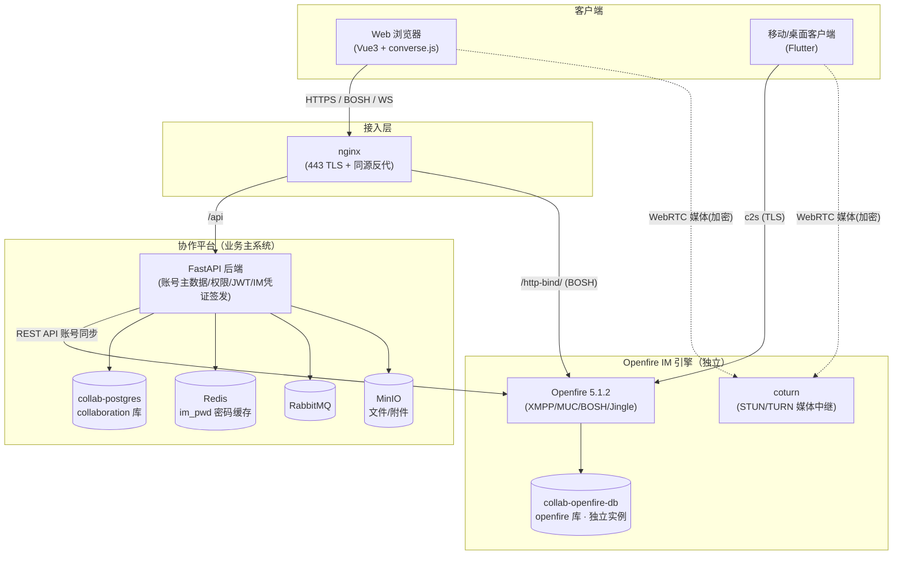
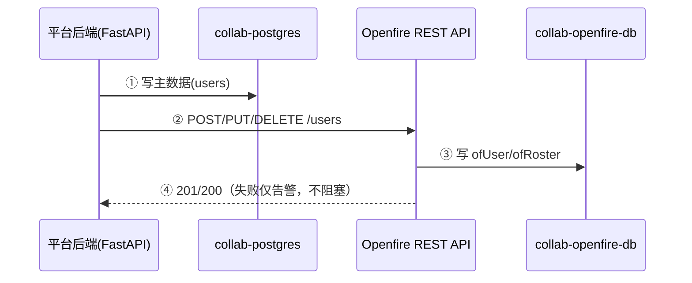
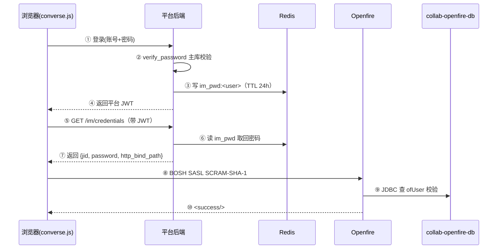
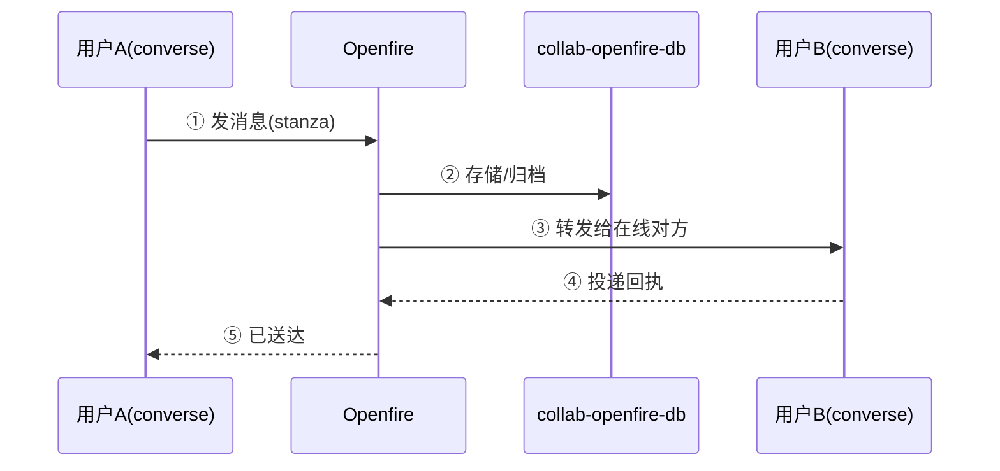
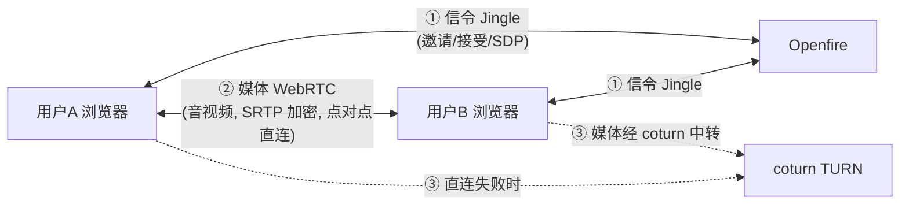

# Openfire 作为协作平台 IM 服务端的设计框架与安全

> 版本：2026-09-19
> 前提：PRD（mindful-collaboration）中所有「野火 IM / Wildfire IM / Wildfire SDK / Wildfire Token / Wildfire DB」**统一替换为 Openfire**。本文按替换后的口径，结合当前 Openfire 5.1.2 实际部署，给出服务端设计框架、集成细节与安全设计。
> 安全红线：本文所有密码 / 密钥 / 连接串一律 [REDACTED]，不写明文。

---

## 1. 定位与总体架构

Openfire 在 PRD 五层架构中位于 **能力引擎层（Capability Engines）**，与 OnlyOffice、MinIO 并列——是「纯 XMPP/IM 引擎」，不维护企业主数据、不维护核心 ACL。

**分层视图**：

```
访问层        Web(Vue3) / Flutter 客户端
统一身份      API Gateway(JWT) ← Keycloak(企业身份, M6 可选)
业务平台层    消息 / 日历 / 通讯录 / 工作组 / 系统管理 / 通知中心
能力引擎层    ★ Openfire(XMPP/IM)  OnlyOffice  MinIO
基础设施      PostgreSQL(平台库)  PostgreSQL(Openfire 独立实例)  Redis  RabbitMQ  MinIO  coturn
```

**组件架构图**：



**职责边界（与 PRD 集成约束一致）**：
- Openfire 只做能力执行：单聊、群聊（MUC）、presence、roster、音视频信令（Jingle）。
- **权限 / ACL 统一在协作平台**，Openfire 不维护企业权限；第三方组件只做能力执行，授权需平台校验后签发凭证。

---

## 2. 账号与认证设计（核心）

### 2.1 账号主数据与影子账号

PRD 账号体系 = 本地账号主通道 + Keycloak 企业身份（M6 可选，JIT 映射）。Openfire 与之解耦，**始终只收「同步结果」**。

| 维度 | 协作平台（主数据） | Openfire（影子） |
|---|---|---|
| 存储 | 平台 postgres（`collaboration` 库）`users` 表 | Openfire **独立 postgres 实例**（`openfire` 库）`ofUser` 表 |
| 密码 | `password_hash`（bcrypt 强哈希） | `encryptedPassword`（Blowfish 可逆） |
| 认证 | `auth_service.authenticate` → `verify_password` | 默认 `DefaultAuthProvider`（JDBC） |
| 账号来源 | 平台建号 / 改密 / Keycloak JIT 映射 | 平台后端同步写入，**不接 LDAP/AD** |

**未来 M6 Keycloak 接入**：企业账号经 Keycloak 校验 → JIT 映射/创建本地用户（工号唯一键）→ 走同一 `sync_user_to_openfire` 同步到 Openfire。Openfire 侧零改动。

### 2.2 同步链路

```
建号/改密/重置密码/禁用/删除
        │
        ▼
im_service.sync_user_to_openfire(user, password)
        └─ Openfire REST API 插件（POST/PUT/DELETE /users + roster，见 §4）
        │
        └─ 失败仅告警，不阻塞建号/登录主链路
```

**账号同步数据流**：



- **触发点**：`create_user` / `reset_password` / `change_password` / `set_user_status`（禁用/删除/恢复在职，见 §6.3）。
- **roster 全员可见**：经 REST API `POST /users/{username}/roster`（sub=3 双向订阅），实现「全员通讯录」。
- **JID 规则**：`<username 小写>@xmpp.collab.local`。Openfire `DefaultAuthProvider.authenticate` 会 `trim().toLowerCase()` 后精确查 `ofUser.username`，故 ofUser 用户名必须存小写、无空格。

### 2.3 客户端认证凭证流（IM 登录）

PRD 的「Wildfire IM Token」在 Openfire 下等价为 **XMPP 凭证（JID + 密码）经 BOSH/WS SASL 认证**：

```
平台登录(本地/Keycloak) → 后端签发平台 JWT
        │ 登录时把明文密码写入 Redis im_pwd:<username>（TTL 24h）
        ▼
前端 GET /api/v1/im/credentials（带 JWT）→ 返回 {jid, domain, http_bind_path, password}
        ▼
converse.js 经 BOSH(/http-bind/) SASL SCRAM-SHA-1 → Openfire JDBC 认证（ofUser.encryptedPassword）
```

**IM 登录认证数据流**：



**设计取舍**：Openfire JDBC 认证需要可逆密码比对，故 `ofUser` 存 `encryptedPassword`（Blowfish 可逆）、Redis 缓存明文密码。密码**不落前端**（不写 localStorage/sessionStorage），由 JWT 从服务端换取。

---

## 3. IM 能力映射（野火 → Openfire）

| PRD 要求的能力 | Openfire 实现 | 状态 |
|---|---|---|
| 单聊（文本/图片/文件/表情） | XMPP message + XEP-0363 附件上传 | ✅ 已实现 |
| 群聊（建群/拉人/退群/群设置/@提醒） | MUC `conference.xmpp.collab.local` | ✅ 已实现 |
| 1v1 音视频通话 | Jingle 信令 + WebRTC + coturn(TURN) | ✅ 已实现 |
| 系统消息（通知公告推送） | bot 账号广播 / admin 系统消息 | ⚠️ 需补（通知中心 → Openfire 通道） |
| 消息已读回执 | XEP-0184 投递回执 + XEP-0333 已读标记 | ⚠️ converse 部分支持，需验证 |
| 多方音视频会议 | Openfire **无内置 SFU** | ❌ 缺失（需另选 Jitsi/Janus，Jitsi 已排除） |
| 会议录制 | Openfire **无内置录制** | ❌ 缺失 |
| 移动离线推送（APNs/FCM/厂商） | Openfire 社区版**无内置推送** | ❌ 缺失（需 Push 插件 + 自研） |
| 官方 Flutter/PC SDK | 无官方 SDK | ⚠️ 用通用 XMPP 库（Web converse.js；移动 Smack / Flutter xmpp 社区包） |
| 商业版集群 | 社区版，4.9 集群 MUC/BOSH 复制不完整 | ⚠️ 见 §7 HA |

**结论**：Openfire 完整覆盖 IM 核心（单聊/群聊/1v1 音视频），但 **多方会议、录制、离线推送、官方 SDK 四项能力缺失**，需在落地时明确替代方案（§8）。

**消息收发数据流**：



**音视频数据流（信令与媒体分离）**：



> 关键：信令（控制消息）走 Openfire，媒体（音视频数据）走浏览器点对点 + coturn 中转，Openfire **不承载媒体流**。

---

## 4. API 对接设计（路线 B 定案）

### 4.1 对接架构与角色边界

```
协作平台后端 (FastAPI)
   │  建号/改密/禁用/删除/重置密码
   │  HTTP 调用 REST API
   ▼
Openfire REST API 插件 (/plugins/restapi/v1)
   ▼
Openfire 用户库 (ofUser) + 通讯录 (ofRoster)
```

- **平台 = 账号主数据**，Openfire = 影子账号（跟着同步）。
- **核心原则**：只通过 REST API 调 Openfire，**禁止直连 Openfire 数据库**（PRD 约束 1）；同步失败不阻塞平台主流程，只告警 + 重试/对账补同步。

### 4.2 API 详细清单

> 完整路径前缀：`http://<Openfire地址>:<管理台端口>/plugins/restapi/v1`（本文简称 `/users` 等）。

| # | 方法 + 路径 | 用途 | 平台触发时机 |
|---|---|---|---|
| 1 | `POST /users` | 创建 IM 账号 | 平台建新用户 |
| 2 | `GET /users/{username}` | 查询账号是否存在 | 校验/对账 |
| 3 | `PUT /users/{username}` | 修改密码/资料 | 改密、重置密码、改姓名邮箱 |
| 4 | `DELETE /users/{username}` | 删除账号 | 用户离职/注销 |
| 5 | `POST /users/{username}/roster` | 加联系人（通讯录） | 建双向通讯录关系 |
| 6 | `GET /users/{username}/roster` | 查询联系人 | 对账/排障 |
| 7 | `GET /sessions` | 查询在线会话 | 排障/监控（可选） |

**认证方式（二选一）**：

| 方式 | 怎么传 | 适用 |
|---|---|---|
| HTTP Basic Auth | 请求头 `Authorization: Basic <base64(admin:密码)>`，即 `curl -u "admin:密码"` | 简单，管理台账号 |
| Secret Key（推荐） | 请求头 `Authorization: <secretKey>`，secretKey 在插件配置 `plugin.restapi.secretKey` | 避免暴露 admin 弱口令 |

**接口 1 — 创建用户** `POST /users`：

```json
{
  "username": "zhangsan",   // 必填，唯一，全小写、无空格
  "name": "张三",            // 可选，显示名
  "email": "zs@example.com", // 可选
  "password": "<明文密码>"   // 必填，Openfire 内部加密存储
}
```

成功 `201`；失败 `409`(已存在) / `400`(缺字段) / `401`(认证失败)。

```bash
curl -u "admin:<ADMIN_PWD>" -H "Content-Type: application/json" \
  -X POST http://localhost:19090/plugins/restapi/v1/users \
  -d '{"username":"zhangsan","name":"张三","email":"zs@example.com","password":"<测试密码>"}'
```

> ⚠️ `username` 必须全小写、无空格：Openfire 认证会 `trim().toLowerCase()` 后精确查库，大写或空格会导致「密码正确却登录失败」。

**接口 2 — 查询用户** `GET /users/{username}`：成功 `200`；失败 `404`/`401`。

**接口 3 — 修改用户** `PUT /users/{username}`，只传要改的字段：

```json
{ "password": "<新密码>" }                          // 改密
{ "name": "张三丰", "email": "zsf@example.com" }    // 改资料
```

成功 `200`；失败 `404`/`401`。

**接口 4 — 删除用户** `DELETE /users/{username}`：成功 `200`；失败 `404`/`401`。

**接口 5 — 加联系人** `POST /users/{username}/roster`：

```json
{
  "jid": "lisi@xmpp.collab.local",  // 对方 JID（用户名@域）
  "nickname": "李四",                 // 显示昵称
  "subscriptionType": "3"            // -1移除/0无/1对方订阅我/2我订阅对方/3双向
}
```

成功 `201`；`subscriptionType=3` 表示双向订阅（全员通讯录用）。双向 = 对 A 加 B + 对 B 加 A，各调一次。

**接口 6 — 查询联系人** `GET /users/{username}/roster`：`200` + roster 列表 JSON。

**接口 7 — 在线会话**（可选）`GET /sessions`：`200` + 在线会话列表 JSON。

### 4.3 账号同步逻辑（触发规则）

| 平台事件 | 调用的接口 | 说明 |
|---|---|---|
| 创建用户 | `POST /users` | 同步用户名+姓名+邮箱+明文密码 |
| 修改/重置密码 | `PUT /users/{username}` | 传新密码 |
| 修改姓名/邮箱 | `PUT /users/{username}` | 传 name/email |
| 禁用用户 | `PUT /users/{username}` 改密码锁死 **或** `DELETE /users/{username}` | 二选一，与平台定 |
| 删除用户 | `DELETE /users/{username}` | 同步删除影子账号 |
| 建通讯录关系 | `POST /users/{a}/roster` + `POST /users/{b}/roster` | 双向各一次 |

### 4.4 错误处理约定

| HTTP 码 | 含义 | 平台处理 |
|---|---|---|
| 201 / 200 | 成功 | 继续 |
| 401 | 认证失败 | 检查 admin 账号/secretKey，告警 |
| 404 | 目标不存在 | 按幂等处理（删除已删的→忽略） |
| 409 | 冲突（重复建号） | 改为调用 `PUT` 更新 |
| 400 | 参数错 | 检查字段格式，告警 |

### 4.5 客户端 → Openfire（数据面）

| 通道 | 端口（容器→宿主机） | 用途 |
|---|---|---|
| BOSH `/http-bind/` | 7070（容器内），浏览器走 nginx 443 同源反代 | Web converse.js 主通道 |
| WebSocket | 7443（容器内），nginx 反代 | 备用 |
| c2s | 5223 → 15223（TLS；明文 5222 已关） | 原生客户端 |
| 管理台 | 9090 → 19090（仅本机；9091 HTTPS 未启用） | 运维 |

### 4.6 通知中心 → Openfire

公告发布 → 后端（范围判定）→ MQ → 通知中心 → **Openfire 系统消息**（专用 bot 账号按范围广播到目标用户的 roster/会话）。当前为「待补」项。

### 4.7 消息文件归档

聊天文件/图片 → XEP-0363 上传（announced URL 指向 nginx `/httpfileupload/`）→ MQ 事件 → 文档模块「消息文件」目录归档。与 PRD「消息文件自动归档」一致。

---

## 5. 数据归属与边界

| 数据 | 归属 | 约束 |
|---|---|---|
| 用户/组织/权限/日历/文档元数据 | 平台 postgres（`collaboration` 库，主数据） | 平台唯一权威 |
| 消息内容 / 群聊记录 / roster | Openfire 独立 postgres 实例（`openfire` 库：ofMessageArchive/ofMucRoom/ofRoster） | 平台**只存会话元数据与引用**，不复制消息内容 |
| IM 明文密码 | Redis（TTL 24h）+ Openfire ofUser | 服务端持有，前端不落盘 |
| 媒体流 | coturn 中转 | Openfire 不承载媒体 |

**数据库部署（独立实例，2026-09-19 定案）**：Openfire 使用**独立的 postgres 实例**（容器 `collab-openfire-db`），与平台 postgres（`collab-postgres`）物理隔离。

```
collab-postgres      ── collaboration 库（平台业务，账号 collab_app）
collab-openfire-db   ── openfire 库（IM，账号 openfire；独立实例/卷/端口 25432）
```

**隔离理由**：故障隔离——Openfire 数据库维护/故障/重启不影响平台核心库，反之亦然；两个实例各自独立备份、独立升级、独立 HA，避免「维护一个实例影响所有服务」。

**⚠️ 边界取舍（已定案：路线 B）**：PRD §5 约束 1「禁止直接读写外部组件数据库」。历史实现用 asyncpg 直连 Openfire 库写 `ofUser/ofRoster`（路线 A），**违背此约束**。已定案切 **路线 B**：账号 CRUD 与 roster 全部走 REST API（见 §4），后端彻底不碰 Openfire DB。

> 路线 A（直连 DB）为历史实现，随路线 B 落地移除；REST API 插件的 roster 端点可保留「全员通讯录」，无需前端兜底。

---

## 6. 服务安全设计（重点）

### 6.1 传输层安全

| 面 | 现状（2026-09-20） | 说明 |
|---|---|---|
| c2s 明文 5222（15222） | ✅ 已关闭 | 仅保留 TLS 5223（15223） |
| 管理台 HTTP 9090（19090） | ✅ 已收敛 | 仅绑定 127.0.0.1 本机访问；9091 HTTPS 未启用（缺 keystore） |
| BOSH 明文 7070（17070） | ✅ 已关闭 | 仅走 nginx /http-bind/ 反代 |
| FTP 7777（17777） | ✅ 已关闭 | 附件走 httpfileupload |
| WebSocket 7443（17443） | ⚠️ 保留 | 建议后续仅经 nginx WSS 反代 |
| coturn 13478 | 媒体 DTLS-SRTP 加密 | 校验 fingerprint、TLS 证书 |

### 6.2 认证与凭据安全

| 项 | 现状（2026-09-20） | 说明 |
|---|---|---|
| ofUser 密码 | ✅ encryptedPassword（Blowfish 可逆） | 路线 B REST API 落库 + 存量 3 账号已迁移 |
| Redis im_pwd | ✅ 已加 requirepass | 端口 6379 明文缓存不再裸奔 |
| SASL 认证 | ✅ SCRAM-SHA-1（原生启用） | Openfire 广告 SCRAM，converse 自动优先协商，密码不上网 |
| openfire.xml DB 密码 | ✅ Blowfish 加密 | `<password encrypted="true">` + security.xml `<key><current>` 密钥 |
| 平台 JWT | HS256，secret ≥32B | secret 环境变量注入 + 定期轮换 |

### 6.3 授权与账号生命周期

- **权限统一在平台**：谁能建群、拉人、看通讯录由平台 ACL 决定；Openfire MUC 权限（owner/admin/member）由平台发起时映射。
- **禁用/删除用户**（✅ 已实现）：停用（status=0）→ `DELETE /users` 删影子账号、保留缓存密码（便于恢复）；离职（status=2）→ 删影子账号 + 清缓存密码；恢复在职（status=1）→ 从缓存取回密码重建影子账号。**离职/停用用户立即失去 IM 登录能力**（BOSH 返回 `<not-authorized/>`）。
- **域隔离**：`xmpp.collab.local` 域内认证，禁止跨域/域外账号注册（Openfire 默认关闭自注册，需确认）。

### 6.4 攻击面收敛

- **管理台弱密码**：默认 `admin` 弱密码需强密码 + 限制来源 IP。
- **暴力破解**：BOSH/c2s 认证加失败限速（Openfire 有 `security.` 属性可配）；管理台加 fail2ban 或 nginx limit_req。
- **BOSH 资源耗尽**：限制单连接会话数、长轮询超时（`xmpp.httpbind.client.idle` 已调 1800）。
- **端口最小暴露**：宿主机仅暴露 web 443（BOSH/WS/附件全走反代）+ coturn 媒体端口；Openfire 原生端口（19090/17070/15222/17443/17777）仅内网可达。

### 6.5 审计与合规

- **消息归档**：Openfire Monitoring 插件开消息归档（ofMessageArchive），满足企业审计/合规要求。
- **操作留痕**：平台侧登录/授权/建号/改密/禁用/删除全部入平台操作日志（已实现）；Openfire 侧开启 admin 审计日志。
- **日志安全**：结构化 JSON 集中采集，脱敏密码字段（禁止日志打印明文密码）。

---

## 7. 高可用与部署

| 优先级 | 目标 | 方案 |
|---|---|---|
| P0 | 数据层 HA | **两个 postgres 各自主从**：平台库（collaboration）与 Openfire 库（openfire）独立实例、独立备份、独立主从 |
| P1 | IM 横向扩展 | Openfire 多节点 + BOSH sticky（LB 按会话粘滞）；接受「断线重连恢复」而非无感切换 |
| P2 | 依赖降级 + 可观测 | Redis 哨兵、RabbitMQ 镜像队列、MinIO 多节点；Prometheus JMX exporter + IM 状态 API |

**Openfire 集群限制**（社区版）：MUC/BOSH 会话复制不完整，故采用「无状态多节点 + sticky + 重连恢复」而非强一致集群；这是与野火商业版集群的明确差距。

---

## 8. 能力差异与风险（替换野火后的缺口）

| 缺口 | 影响 | 替代方案 |
|---|---|---|
| 多方会议（SFU） | 无法 N 人音视频会议 | 引入 Janus/Jitsi（Jitsi 已排除，需另选）或购买第三方会议 |
| 会议录制 | 无法录制会议 | 引入录制组件（如 Jibri/自研 SFU 录制） |
| 离线推送（APNs/FCM/厂商） | 移动端离线收不到消息 | Openfire Push 插件 + 自研推送网关 |
| 官方 Flutter/PC SDK | 客户端集成成本高 | Web converse.js；移动 Smack / Flutter `xmpp` 社区包自封装 |
| 商业支持 | 无官方 SLA | 自运维 + 内部排障能力 |

> 这些缺口对应 PRD M6 的「音视频会议/录制」与 M5 的「移动推送」，需在里程碑排期时单独评估，不能默认 Openfire 无缝承接野火商业版能力。

---

## 9. 里程碑落地映射

| PRD 里程碑 | Openfire 落地 |
|---|---|
| M5 消息 | 已基本完成：单聊/群聊/附件/1v1 音视频 + converse.js 前端 |
| M5 通知中心/公告 | 补 Openfire 系统消息通道（bot 广播） |
| M6 音视频会议/录制 | **能力缺口，需另选组件**，不在 Openfire 范围内 |
| M6 Keycloak 企业身份 | 平台 JIT 映射后复用 `sync_user_to_openfire`，Openfire 零改动 |
| M6 三端 | Web=converse.js（已就绪）；Flutter 端用社区 XMPP 库（未开始） |
